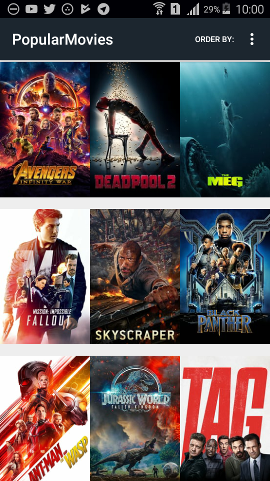
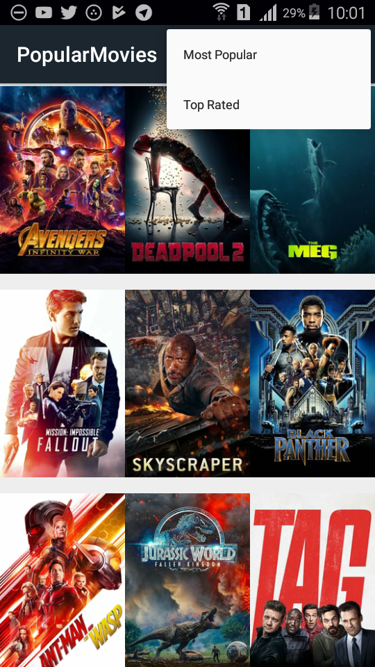
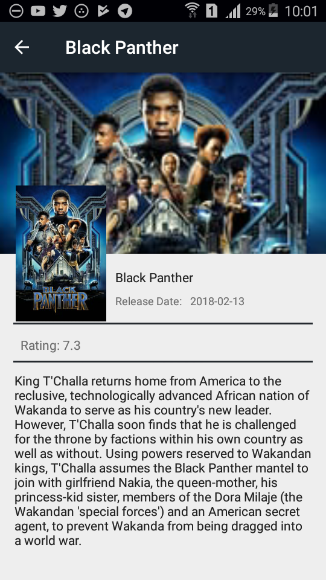

# PopularMovies :movie_camera:
Udacity Nano degree Second Project, querying The MovieDB API to display movie details

## Screen Shots :camera:
 |  | 
---------------------------------------------------------------|------------------------------------------------------------|---------------------------------------------------------------------
**Poster Grid** | **Sort By Top Rated or Most Popular** | **Display Selected Movie Details**

### _App Functions_
* Display Top Rated or Most Popular Movies according to data provided by themovieDB API
* Display Movie Details, when Image is clicked in the main grid
* Sort Movie Posters based on top rated or most popular choices
* Check internet connectivity and notify user if not connected to internet

##### *References: :link:*
 [Constraint Layout Guidelines, Barriers, Chains and Groups - Riggaroo – Android Dev]( https://riggaroo.co.za/constraintlayout-guidelines-barriers-chains-groups/)

 [GitHub: Hiding (secret) API keys – Tutorial](https://richardroseblog.wordpress.com/2016/05/29/hiding-secret-api-keys-from-git/)

 [Using Parcelable](https://guides.codepath.com/android/using-parcelable)
